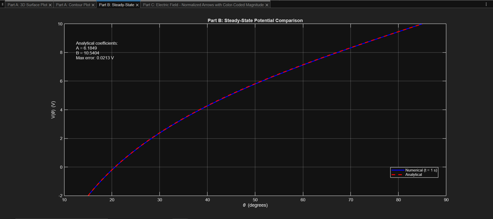
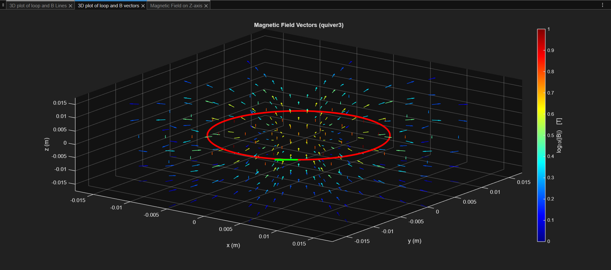

# Electromagnetics Field Simulation – MATLAB

This repository contains MATLAB codes developed for my undergraduate **Electromagnetics course project**.

The objective of this project was to numerically compute and visualize electric and magnetic fields using fundamental electromagnetic laws, and compare numerical results with analytical solutions where possible.

---

## 📁 Repository Structure

```
/Codes
    Q1.m
    Q2.m
    Q3.m
    Q4.m

/ProjectScreenshots
    Q1PartA.png
    Q1PartB.png
    Q1PartC.png
    Q2PartA.png
    Q2PartB.png
    Q3PartA3D.png
    Q3PartAContour.png
    Q3PartB.png
    Q3PartC.png
    Q4Lines.png
    Q4Vectors.png
    Q4Z.png
```

---

# Project Overview

The project consists of four main parts:

- **Q1** – Electric field of a uniformly charged sphere  
- **Q2** – Electric potential and field of point charges  
- **Q3** – Laplace equation between two conical surfaces  
- **Q4** – Magnetic field of a circular current loop  

Each part focuses on translating electromagnetic theory into numerical simulation and visualization.

---

# Q1 – Uniformly Charged Sphere (Gauss’s Law)

### Objective
Compute and visualize the electric field of:
- A solid sphere with uniform charge density
- A hollow spherical shell

### Concept
Using Gauss’s Law:
- Inside solid sphere → field increases linearly with radius
- Outside sphere → field decreases as 1/r²
- Inside hollow shell → field is zero

### Code
`Q1.m`:
- Computes enclosed charge
- Computes electric field analytically
- Plots field vs radius
- Generates 3D visualization

### Screenshots

#### Solid Sphere – Field Distribution


#### Field vs Radius


#### Hollow Shell Case


---

# Q2 – Electric Field and Potential of Point Charges

### Objective
Calculate:
- Electric potential from multiple point charges
- Electric field using numerical gradient
- Field behavior along coordinate axes

### Concept
- Potential behaves as 1/r
- Electric field behaves as 1/r²
- Superposition principle applied

### Code
`Q2.m`:
- Computes total potential
- Uses `gradient()` to compute E
- Plots contour maps
- Plots vector field
- Uses log-scale for magnitude visualization

### Screenshots

#### Potential Contour


#### Electric Field Vectors


---

# Q3 – Laplace Equation Between Conical Surfaces

### Objective
Solve Laplace’s equation between two infinite cones with fixed potentials.

### Concept
- Boundary-value problem
- Angular dependence of potential
- Electric field derived from potential

### Code
`Q3.m`:
- Uses MATLAB `pdepe`
- Computes steady-state potential
- Compares numerical and analytical solutions
- Derives electric field

### Screenshots

#### 3D Potential Distribution


#### Contour Plot


#### Electric Field Plot


#### Numerical vs Analytical Comparison


---

# Q4 – Magnetic Field of a Circular Current Loop

### Objective
Compute magnetic field produced by a circular loop using the Biot–Savart law.

### Concept
- Discretized current loop
- 3D magnetic field computation
- Comparison with analytical on-axis solution

### Code
`Q4.m`:
- Implements Biot–Savart law numerically
- Computes magnetic field in 3D space
- Normalizes vectors for clarity
- Uses log-scale magnitude mapping

### Screenshots

#### Magnetic Field Lines


#### Magnetic Field Vectors


#### Magnetic Field Along Z-axis


---

# Techniques Used

- Numerical field computation
- MATLAB PDE solver (`pdepe`)
- Gradient-based electric field extraction
- Biot–Savart numerical integration
- 3D vector visualization (`quiver3`)
- Log-scale magnitude mapping
- Analytical vs numerical validation

---

# Summary

This project demonstrates:

- Application of electromagnetic theory
- Numerical modeling of electric and magnetic fields
- PDE-based boundary-value solving
- Field visualization in 2D and 3D
- Validation of numerical results against analytical expressions

---

Electrical Engineering – Electromagnetics  
MATLAB | Numerical Methods | Field Visualization
